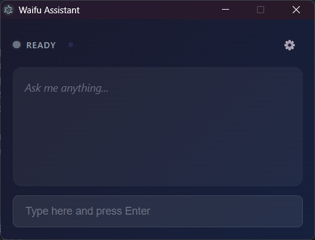
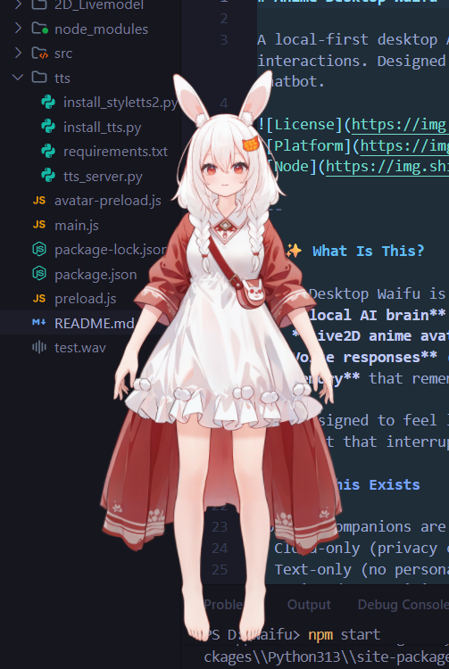

# Anime Desktop Waifu

A local-first desktop AI companion with a Live2D anime avatar that reacts visually to your interactions. Designed to be a calm, quiet presence on your desktop — not an aggressive chatbot.


---

## ✨ What Is This?

Anime Desktop Waifu is a desktop companion that combines:
- A **local AI brain** running on your machine
- A **Live2D anime avatar** that responds visually
- **Voice responses** (optional, uses system text-to-speech)
- **Memory** that remembers things you tell it

It's designed to feel like a quiet friend who sits on your desktop, not a hyperactive assistant that interrupts you constantly.

### Why This Exists

Most AI companions are either:
- Cloud-only (privacy concerns, requires internet)
- Text-only (no personality or presence)
- Designed to maximize engagement (annoying)

This project takes a different approach: **your companion, your rules, your machine**.

---

## 🎯 Key Features

### 🧠 Local & Hybrid AI

Your conversations stay on your machine by default.

- **Local Mode**: Uses Ollama to run AI models entirely offline
- **Cloud Mode**: Optional Gemini API integration when you want it
- **Your Choice**: Switch between local-only, cloud-preferred, or hybrid modes anytime

No internet required for basic operation.

### 🎭 Live2D Anime Avatar

A visual companion that reacts to your conversation.

- Responds to your messages with expressions and motions
- Follows your cursor for a sense of awareness
- Reacts to interaction (try giving her a gentle boop!)
- **Drag Mode**: Move her anywhere on your screen using the toggle menu
- Transparent overlay that sits on your desktop

The avatar is a visual layer — she displays what the AI is "feeling," but she's not the AI itself.

### 🗣️ Voice Responses

Optional spoken responses to messages.

- Uses your system's built-in text-to-speech
- Toggle voice on/off at any time
- Adjustable voice selection and speed

> **Note**: System TTS sounds robotic. Anime-style neural voices are planned for future updates.

### 💾 Intelligent Memory

Remembers things naturally, forgets gracefully.

- **Session Memory**: Keeps track of your current conversation
- **Long-term Facts**: Remembers important things you tell it
- **Confidence-based**: Facts it's unsure about fade over time
- **Contradiction Handling**: Updates beliefs when you correct it

Your data is stored locally in simple JSON files.

### ⚙️ User Control

You decide how the companion behaves.

- Toggle avatar visibility
- Toggle voice responses
- **Drag vs. Interact Mode**: Toggle between moving the window or interacting with the avatar
- Switch AI modes (local/cloud/hybrid)
- Adjust response length and behavior
- All settings accessible from the settings panel

---

## 📸 Screenshots

<table>
  <tr>
    <td align="center">
      
      <br/>
      <b>Chat Window</b>
      <br/>
      <em>Clean interface for conversation</em>
    </td>
    <td align="center">
      
      <br/>
      <b>Settings Panel</b>
      <br/>
      <em>AI mode, voice, and avatar controls</em>
    </td>
  </tr>
</table>

<p align="center">
  
  <br/>
  <b>Live2D Avatar Overlay</b>
  <br/>
  <em>杀人小兔 (Killer Bunny) — Transparent desktop companion</em>
</p>

---

## 🚀 Installation (For Everyone)

Don't worry if you're not technical — follow these steps carefully and you'll be fine.

### Step 1: Install Node.js

1. Go to [nodejs.org](https://nodejs.org/)
2. Download the **LTS** version (the one that says "Recommended")
3. Run the installer and click "Next" through everything
4. Restart your computer after installation

### Step 2: Install Python (Required for Voice)

> **Note**: If you don't want voice features, you can skip this step. The app will work without voice.

1. Go to [python.org/downloads](https://www.python.org/downloads/)
2. Download Python 3.10 or newer
3. **Important**: During installation, check the box that says **"Add Python to PATH"**
4. Complete the installation

### Step 3: Download This Project

**Option A: Download as ZIP**
1. Click the green "Code" button on this page
2. Click "Download ZIP"
3. Extract the ZIP to a folder you'll remember (like `Documents\AnimeWaifu`)

**Option B: Use Git** (if you have it installed)
```bash
git clone https://github.com/Lokesh-shiva/Anime-desktop-waifu.git
cd Anime-desktop-waifu
```

### Step 4: Install Dependencies

1. Open the folder where you extracted/cloned the project
2. Hold `Shift` and right-click in the folder
3. Click "Open PowerShell window here" (or "Open in Terminal")
4. Run these commands:

```bash
# Install Node.js dependencies
npm install

# Install Python dependencies for voice (optional but recommended)
pip install -r tts/requirements.txt
```

### Step 5: Start the App

In the same terminal window, type:

```bash
npm start
```

The app should open! 🎉

### First Run Notes

- The first launch may take a few extra seconds
- Internet is only needed if you want to use cloud AI features
- The avatar may take a moment to load
- If something looks wrong, try closing and reopening the app
- **Voice not working?** Make sure Python is installed and you ran `pip install -r tts/requirements.txt`

### Configuring the AI Brain

The app needs an AI to generate responses. You have three options:

#### Option A: Local Only (Ollama) — Fully Offline

1. Download and install [Ollama](https://ollama.ai/)
2. Open a terminal and run:
   ```bash
   ollama pull phi4-mini:3.8b
   ```
3. Ollama runs in the background automatically
4. In the app, select **"Local Only"** in the settings

> ✅ No internet required after setup. Your conversations stay on your machine.

#### Option B: Cloud Only (Gemini API) — Requires Internet

1. Go to [Google AI Studio](https://aistudio.google.com/apikey)
2. Create a free API key
3. Open the app and go to Settings (⚙️ icon)
4. Paste your API key in the **API Key** field
5. Select **"Cloud Only"** in the settings

> ⚠️ Requires internet. Conversations are sent to Google's servers.

#### Option C: Cloud with Fallback (Recommended for Most Users)

1. Set up Gemini API key (see Option B)
2. Optionally install Ollama (see Option A)
3. Select **"Cloud (fallback)"** in the settings

> This uses cloud when available, falls back to local if offline or if cloud fails.

---

## 🛠️ Installation (For Developers)

### Requirements

- **Node.js**: v18.0.0 or higher recommended
- **npm**: Comes with Node.js
- **Electron**: v28.x (installed automatically via npm)
- **Python**: 3.10+ (required for voice features)
- **OS**: Windows 10/11 (primary support), other platforms untested

### Voice Dependencies (Python)

```bash
# System TTS (required for voice)
pip install -r tts/requirements.txt
```

This installs: `fastapi`, `uvicorn`, `pyttsx3`, `soundfile`, `numpy`

For **Neural TTS (Experimental)**:
```bash
pip install styletts2
```
> ⚠️ StyleTTS2 requires additional setup and a GPU is recommended. See [StyleTTS2 docs](https://github.com/yl4579/StyleTTS2) for details.

### Optional: Local LLM with Ollama

For fully offline AI:

1. Install [Ollama](https://ollama.ai/)
2. Pull a model: `ollama pull phi4-mini:3.8b`
3. Ollama runs in the background automatically

If Ollama isn't running, the app will fall back to cloud mode (if configured).

### Project Structure

```
Anime-desktop-waifu/
├── main.js              # Electron main process
├── preload.js           # Preload scripts for IPC
├── src/
│   ├── index.html       # Main window
│   ├── renderer.js      # UI logic
│   ├── styles.css       # Styling
│   ├── avatar/          # Live2D integration
│   ├── llm/             # AI provider routing
│   ├── memory/          # Fact storage and recall
│   ├── presence/        # Awareness features
│   ├── state-machine.js # Conversation state
│   ├── settings.js      # User preferences
│   └── voice/           # TTS integration
├── 2D_Livemodel/        # Live2D model assets
└── tts/                 # TTS server scripts
```

### Running in Development

```bash
npm start
```

Electron will open with DevTools available (`Ctrl+Shift+I`).

---

## 🔊 How Voice Works

Voice is completely optional and can be toggled at any time.

### Current Implementation

- Uses your operating system's built-in text-to-speech engine
- On Windows, this is Microsoft SAPI voices
- Voice selection available in settings
- Adjustable speaking rate

### Honest Expectations

**What it sounds like now**: Robotic. Functional, but clearly synthetic. This is a limitation of system TTS, not something we can fix directly.

**What's planned**: We're exploring anime-style neural TTS solutions. These would sound more natural and expressive, but they're still in development.

### Why Not Just Include Better Voices?

- High-quality neural TTS requires significant resources
- We want to keep the app lightweight and local-first
- Bundling voice models would dramatically increase download size

For now, system TTS is a reasonable trade-off. Better voices are on the roadmap.

---

## 🏗️ Architecture Overview

Here's how the pieces fit together:

```
┌─────────────────────────────────────────────────────────┐
│                      Your Desktop                        │
├─────────────────────────────────────────────────────────┤
│                                                          │
│   ┌──────────────┐     ┌──────────────────────────┐     │
│   │   Avatar     │◄────│     State Machine        │     │
│   │  (Live2D)    │     │  (emotions, reactions)   │     │
│   └──────────────┘     └────────────▲─────────────┘     │
│         │                           │                    │
│         │                           │                    │
│         ▼                           │                    │
│   ┌──────────────┐     ┌────────────┴─────────────┐     │
│   │    Voice     │◄────│       AI Brain           │     │
│   │   (TTS)      │     │   (Ollama / Gemini)      │     │
│   └──────────────┘     └────────────▲─────────────┘     │
│                                      │                   │
│                        ┌─────────────┴──────────────┐   │
│                        │         Memory             │   │
│                        │  (facts, conversation)     │   │
│                        └────────────────────────────┘   │
│                                                          │
└─────────────────────────────────────────────────────────┘
```

### The AI Brain

The core intelligence. Processes your messages and generates responses. Can run locally (Ollama) or in the cloud (Gemini API).

### The Memory System

Stores what the companion knows about you. Facts have confidence scores — things she's sure about stick around, uncertain things fade naturally.

### The State Machine

Tracks the current emotional and conversational state. Decides how the companion should react based on context.

### The Avatar

A visual puppet. Receives instructions from the state machine about what expression to show. She doesn't "think" — she displays.

### Voice (TTS)

Speaks the AI's responses aloud. Completely optional. Works independently of everything else.

---

## 💭 Project Philosophy

### Calm Over Clever

This isn't designed to impress you with how smart it is. It's designed to be a quiet presence that's there when you want it.

### User Control, Always

Every feature can be toggled. Nothing happens without your input. No notifications, no interruptions, no "engagement optimization."

### Privacy by Default

Your conversations are yours. Local-first means no server logs, no training data collection, no third-party access to your chats.

### Presence Over Gimmicks

The avatar isn't here to sell you on AI. She's here to give the companion a face, a presence, something that feels like it's *there*.

### Honest About Limitations

We don't pretend system TTS sounds good. We don't claim the AI is sentient. We build what works and are upfront about what doesn't.

---

## 🗺️ Roadmap

These features are planned but not yet implemented:

| Feature | Status | Description |
|---------|--------|-------------|
| Anime-style Neural TTS | 🔬 Research | Higher quality, more expressive voices |
| Push-to-Talk Input | 📋 Planned | Speak to your companion instead of typing |
| More Avatar Expressions | 📋 Planned | Richer emotional range |
| Performance Optimizations | 📋 Planned | Lower CPU/memory usage |
| Cross-platform Support | 🤔 Considering | macOS and Linux builds |

Want to help with any of these? Contributions welcome!

---

## ⚠️ Known Limitations

Being honest about what doesn't work (yet):

### Voice Quality
System TTS sounds robotic. This is a fundamental limitation of built-in voices, not something the app does wrong. Better voices require neural TTS, which is on the roadmap.

### Speech Input
No speech-to-text yet. You have to type your messages. Push-to-talk is planned for the future.

### Avatar Expressions
The expressiveness depends on the Live2D model. Some models have limited motion/expression parameters. We work with what the model provides.

### Platform Support
Only tested on Windows. It *might* work on macOS/Linux, but there are no guarantees.

### Memory Size
Long-term memory is stored in local files. Very long-term usage may accumulate large memory files. Cleanup tools are planned.

---

## 📄 License

This project is released under the **MIT License**. See [LICENSE](LICENSE) for details.

You're free to use, modify, and distribute this project. Just keep the license notice intact.

---

## 🙏 Credits

### Live2D

This project uses the [pixi-live2d-display](https://github.com/guansss/pixi-live2d-display) library for Live2D integration.

#### Included Model: 杀人小兔 (Killer Bunny)

The Live2D model included in this project is **杀人小兔** (Killer Bunny), created by:

- **Studio**: [大鹅猫工作室 (Daemao Studio)](https://daemao.top/)
- **Modeler**: A猫猫
- **Bilibili**: [Daemao Studio](https://space.bilibili.com/529570436)

**Usage Terms** (per the original license):
- ❌ No redistribution, resale, or re-uploading
- ❌ No commercial use without authorization
- ❌ No modification of textures or defacing the character
- ✅ Personal use for videos, streaming, and VTuber activities is permitted
- ✅ Fan works and derivative creations are allowed

Please respect the creators' terms. If you want to support them or purchase the full version, visit their [official store](https://daemao.huotan.com/) or [Afdian](https://afdian.net/a/daemao).

**Important**: Live2D models are subject to their own licenses. Always check the license of any Live2D model you use.

### Open Source Libraries

- [Electron](https://www.electronjs.org/) — Desktop app framework
- [PixiJS](https://pixijs.com/) — 2D rendering engine
- [pixi-live2d-display](https://github.com/guansss/pixi-live2d-display) — Live2D for PixiJS
- [Ollama](https://ollama.ai/) — Local LLM runtime

### AI Providers

- [Ollama](https://ollama.ai/) — Local AI models
- [Google Gemini](https://ai.google.dev/) — Cloud AI (optional)

---

## 🤝 Contributing

Contributions are welcome! Here's how you can help:

### Reporting Issues

Found a bug? Please [open an issue](https://github.com/Lokesh-shiva/Anime-desktop-waifu/issues) with:
- What you expected to happen
- What actually happened
- Steps to reproduce
- Your system info (Windows version, Node version)

### Suggesting Features

Have an idea? Open an issue with the "enhancement" label. Describe:
- What problem it solves
- How you imagine it working
- Any alternatives you considered

### Contributing Code

1. Fork the repository
2. Create a feature branch (`git checkout -b feature/your-feature`)
3. Make your changes
4. Test thoroughly
5. Submit a pull request

Please keep contributions focused and well-documented. Large changes should be discussed in an issue first.

### Code Style

- Keep it readable over clever
- Comment non-obvious logic
- Follow existing patterns in the codebase

---

## 💬 Support

Having trouble? Here's what to try:

1. **Check the issues** — Someone might have had the same problem
2. **Restart the app** — Sometimes that's all it takes
3. **Reinstall dependencies** — Delete `node_modules` and run `npm install` again
4. **Open an issue** — If nothing else works, describe your problem in detail

---

<p align="center">
  <i>Made with care for people who want a quiet companion on their desktop.</i>
</p>
