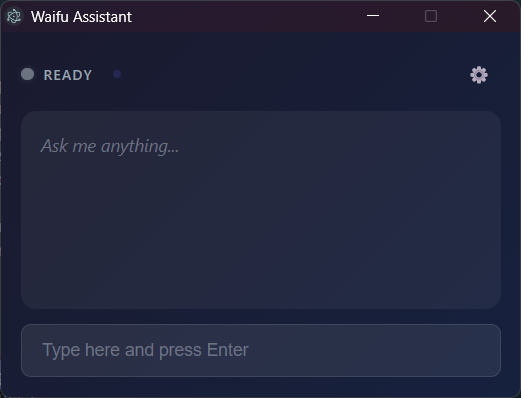
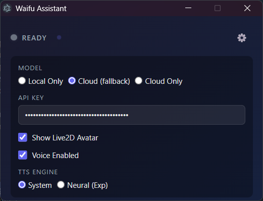
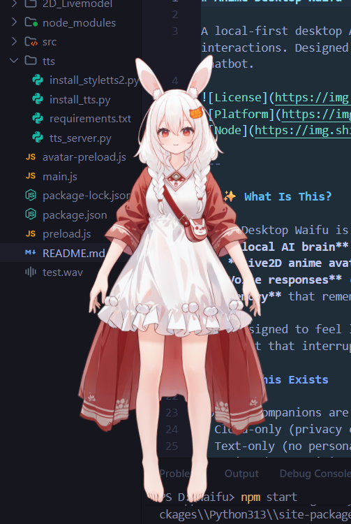

# Anime Desktop Waifu

A local-first desktop AI companion with a Live2D anime avatar that reacts visually to your interactions. Designed to be a calm, quiet presence on your desktop — not an aggressive chatbot.


---

## ✨ What Is This?

Anime Desktop Waifu is a desktop companion that combines:
- A **local AI brain** running on your machine
- A **Live2D anime avatar** that responds visually
- **Voice responses** (optional, uses system text-to-speech)
- **Memory** that remembers things you tell it

It's designed to feel like a quiet friend who sits on your desktop, not a hyperactive assistant that interrupts you constantly.

### Why This Exists

Most AI companions are either:
- Cloud-only (privacy concerns, requires internet)
- Text-only (no personality or presence)
- Designed to maximize engagement (annoying)

This project takes a different approach: **your companion, your rules, your machine**.

---

## 🎯 Key Features

### 🧠 Local & Hybrid AI

Your conversations stay on your machine by default.

- **Local Mode**: Uses Ollama to run AI models entirely offline
- **Cloud Mode**: Optional Gemini API integration when you want it
- **Your Choice**: Switch between local-only, cloud-preferred, or hybrid modes anytime

No internet required for basic operation.

### 🎭 Live2D Anime Avatar

A visual companion that reacts to your conversation.

- Responds to your messages with expressions and motions
- Follows your cursor for a sense of awareness
- Reacts to interaction (try giving her a gentle boop!)
- **Drag Mode**: Move her anywhere on your screen using the toggle menu
- Transparent overlay that sits on your desktop

The avatar is a visual layer — she displays what the AI is "feeling," but she's not the AI itself.

### 🗣️ Voice Responses (Neural TTS + STT)

High-quality spoken responses and push-to-talk input.

- **ElevenLabs Neural TTS**: Anime-quality expressive voices (free tier available)
- **Emotion-driven delivery**: Voice stability, style, and speed change based on what Miko is feeling — sad responses sound different from playful ones
- **System TTS fallback**: Works without an API key using your OS voices
- **Groq Whisper STT**: Push-to-talk speech input via Groq's free Whisper API
  - Hold the 🎤 mic button (or hold **Space**) to speak
  - Release to transcribe and send
- Toggle voice on/off at any time in Settings

#### Setting Up Voice

**ElevenLabs (Recommended)**:
1. Create a free account at [elevenlabs.io](https://elevenlabs.io)
2. Copy your API key from your profile
3. Open Settings → paste key under **ElevenLabs API Key**
4. Select a voice from the dropdown

**Groq Speech-to-Text (Push-to-Talk)**:
1. Get a free API key at [console.groq.com](https://console.groq.com)
2. Open Settings → paste key under **Speech-to-Text (Groq Whisper)**
3. Hold the mic button or hold **Space** to talk

### 🎭 Dynamic Emotion Arc System (New!)

Miko now expresses a full emotional journey across each response — not just a single static expression.

- **Multi-beat emotion arcs**: The AI returns 2–3 emotion beats with timing — e.g. `curious (0%) → tender (50%) → shy (85%)`
- **Timed transitions**: Each beat fires at the right moment during speech, so her face changes as she talks
- **28+ emotion presets** with smooth 800ms ease-in-out transitions between states
- **VT_ELF-specific effects**: Elf ear droop/perk, sweat drops (nervousness), tongue-out (playful), skirt puff (excitement), anger marks, sparkle overlay

#### Emotion Labels Available

| Family | Labels |
|--------|--------|
| Happy | `happy`, `excited`, `love`, `grateful`, `kind`, `playful`, `smug` |
| Sad | `sad`, `crying`, `melancholic`, `lonely`, `longing` |
| Shy | `shy`, `embarrassed`, `flustered`, `hesitant`, `tender`, `calm` |
| Intense | `anger`, `dark`, `disgusted`, `scared`, `determined` |
| Other | `surprised`, `curious`, `confused`, `sleepy`, `neutral` |

### 🎭 Advanced Avatar Features

The avatar system supports dynamic model loading and smart capability detection.

- **Multi-Model Support**: Place any `.model3.json` Live2D model in `2D_Livemodel/` and switch instantly in Settings
- **Smart Capability Detection**: The system auto-discovers each model's parameters — only activates features the model actually supports
- **Capability Badges**: Settings panel shows what the current model can do (blink, blush, breath, eye smile, etc.)
- **Cursor tracking**: Avatar's gaze follows your mouse

### 💾 Intelligent Memory

Remembers things naturally, forgets gracefully.

- **Session Memory**: Keeps track of your current conversation
- **Long-term Facts**: Remembers important things you tell it
- **Confidence-based**: Facts it's unsure about fade over time
- **Contradiction Handling**: Updates beliefs when you correct it

Your data is stored locally in simple JSON files.

### ⚙️ User Control

You decide how the companion behaves.

- Toggle avatar visibility
- Toggle voice responses
- **Drag vs. Interact Mode**: Toggle between moving the window or interacting with the avatar
- Switch AI modes (local/cloud/hybrid)
- Adjust response length and behavior
- All settings accessible from the settings panel

---

## 📸 Screenshots

<table>
  <tr>
    <td align="center">
      
      <br/>
      <b>Chat Window</b>
      <br/>
      <em>Clean interface for conversation</em>
    </td>
    <td align="center">
      
      <br/>
      <b>Settings Panel</b>
      <br/>
      <em>AI mode, voice, and avatar controls</em>
    </td>
  </tr>
</table>

<p align="center">
  
  <br/>
  <b>Live2D Avatar Overlay</b>
  <br/>
  <em>杀人小兔 (Killer Bunny) — Transparent desktop companion</em>
</p>

---

## 🚀 Installation

### The Easy Way — Installer (Recommended)

1. Go to the [**Releases page**](https://github.com/Lokesh-shiva/Anime-desktop-waifu/releases)
2. Download **`Waifu Setup x.x.x.exe`**
3. Run it — no admin rights needed, installs in seconds
4. Launch from the desktop shortcut

That's it. No Node.js, no Python setup, no terminal. 🎉

### First Launch

A setup wizard will guide you through:
1. **AI provider** — pick Gemini (free API key), OpenRouter, or Ollama (local/offline)
2. **Voice** — optional ElevenLabs TTS + Groq speech-to-talk keys
3. **Your companion** — choose between **Elf** or **Alexia** (both recommended!)

Everything can be changed later from the Settings panel.

### Optional: Voice Setup

Voice is not required but makes the experience much better.

**ElevenLabs (Text-to-Speech)**:
1. Create a free account at [elevenlabs.io](https://elevenlabs.io)
2. Copy your API key → paste it in the wizard or Settings → Voice

**Groq (Push-to-Talk / Speech Input)**:
1. Get a free key at [console.groq.com](https://console.groq.com)
2. Paste it in the wizard or Settings → Voice
3. Hold **Space** or the 🎤 button to speak

**Python is required for system TTS fallback** (if you don't use ElevenLabs):
1. Install [Python 3.10+](https://www.python.org/downloads/) — check "Add to PATH"
2. Run: `pip install -r tts/requirements.txt`

### Optional: Local AI with Ollama

For fully offline, private conversations:
1. Install [Ollama](https://ollama.ai/)
2. Pull a model: `ollama pull phi4-mini:3.8b`
3. Select **Ollama** in the wizard or Settings → AI

> ✅ No internet required. Conversations never leave your machine.

---

## 🛠️ For Developers

### Requirements

- **Node.js**: v18+ 
- **Python**: 3.10+ (for voice TTS server)
- **OS**: Windows 10/11

### Setup

```bash
git clone https://github.com/Lokesh-shiva/Anime-desktop-waifu.git
cd Anime-desktop-waifu
npm install
pip install -r tts/requirements.txt   # optional, for system TTS fallback
npm start                              # launches with DevTools open
```

Use `npm run start:dev` to explicitly force dev mode (DevTools + Debug tab).

### Building the Installer

```bash
npm run build
# outputs dist/Waifu Setup x.x.x.exe
```

Releases are also built automatically via GitHub Actions when you push a version tag:
```bash
git tag v1.0.0 && git push origin v1.0.0
```

### Project Structure

```
Anime-desktop-waifu/
├── main.js              # Electron main process
├── preload.js           # Context bridge (IPC)
├── src/
│   ├── index.html       # Main window
│   ├── renderer.js      # UI logic + avatar bridge
│   ├── wizard.js        # First-launch setup wizard
│   ├── settings.js      # localStorage-backed settings
│   ├── avatar/          # Live2D controller + capability registry
│   ├── llm/             # AI adapters (Gemini, OpenRouter, Ollama)
│   ├── memory/          # Fact storage, prompt building, diary
│   ├── presence/        # Time-of-day, idle gestures, typing reactions
│   ├── state-machine.js # IDLE / THINKING / RESPONDING states
│   └── voice/           # TTS + STT adapters
├── 2D_Livemodel/        # Live2D model assets (Elf, Alexia, …)
├── tts/                 # Python TTS server
└── .github/workflows/   # CI — auto-builds release .exe on tag push
```

---

## 🔊 How Voice Works

Voice is completely optional and can be toggled at any time.

### TTS Stack (priority order)

1. **ElevenLabs Neural TTS** (recommended) — anime-quality expressive voices, emotion-driven delivery. Requires a free API key.
2. **System TTS fallback** — uses your OS built-in voices (Microsoft SAPI on Windows). No API key needed, but sounds robotic.

### Emotion-Driven Voice Delivery

When ElevenLabs is active, voice parameters adjust per emotion:
- **Sad / longing / lonely** → lower stability, slower rate, softer style
- **Excited / playful / happy** → higher style, faster rate, more expressive
- **Calm / tender / neutral** → balanced stability, natural rate

This means Miko doesn't just say different words — she *sounds* different depending on what she's feeling.

### Push-to-Talk (Groq Whisper)

Speech input uses Groq's hosted Whisper API (whisper-large-v3-turbo model):
- Hold **Space** or click the 🎤 button → recording starts
- Release → audio is sent to Groq → transcribed text appears in the input box and sends automatically
- Requires a free Groq API key (generous free tier, no credit card needed)

---

## 🏗️ Architecture Overview

Here's how the pieces fit together:

```
┌─────────────────────────────────────────────────────────┐
│                      Your Desktop                        │
├─────────────────────────────────────────────────────────┤
│                                                          │
│   ┌──────────────┐     ┌──────────────────────────┐     │
│   │   Avatar     │◄────│     State Machine        │     │
│   │  (Live2D)    │     │  (emotions, reactions)   │     │
│   └──────────────┘     └────────────▲─────────────┘     │
│         │                           │                    │
│         │                           │                    │
│         ▼                           │                    │
│   ┌──────────────┐     ┌────────────┴─────────────┐     │
│   │    Voice     │◄────│       AI Brain           │     │
│   │   (TTS)      │     │   (Ollama / Gemini)      │     │
│   └──────────────┘     └────────────▲─────────────┘     │
│                                      │                   │
│                        ┌─────────────┴──────────────┐   │
│                        │         Memory             │   │
│                        │  (facts, conversation)     │   │
│                        └────────────────────────────┘   │
│                                                          │
└─────────────────────────────────────────────────────────┘
```

### The AI Brain

The core intelligence. Processes your messages and generates responses. Can run locally (Ollama) or in the cloud (Gemini API).

### The Memory System

Stores what the companion knows about you. Facts have confidence scores — things she's sure about stick around, uncertain things fade naturally.

### The State Machine

Tracks the current emotional and conversational state. Decides how the companion should react based on context.

### The Avatar

A visual puppet. Receives instructions from the state machine about what expression to show. She doesn't "think" — she displays.

### Voice (TTS)

Speaks the AI's responses aloud. Completely optional. Works independently of everything else.

---

## 💭 Project Philosophy

### Calm Over Clever

This isn't designed to impress you with how smart it is. It's designed to be a quiet presence that's there when you want it.

### User Control, Always

Every feature can be toggled. Nothing happens without your input. No notifications, no interruptions, no "engagement optimization."

### Privacy by Default

Your conversations are yours. Local-first means no server logs, no training data collection, no third-party access to your chats.

### Presence Over Gimmicks

The avatar isn't here to sell you on AI. She's here to give the companion a face, a presence, something that feels like it's *there*.

### Honest About Limitations

We don't pretend system TTS sounds good. We don't claim the AI is sentient. We build what works and are upfront about what doesn't.

---

## 🗺️ Roadmap

| Feature | Status | Description |
|---------|--------|-------------|
| Anime-style Neural TTS | ✅ Done | ElevenLabs neural TTS with emotion-driven delivery |
| Push-to-Talk Input | ✅ Done | Groq Whisper STT — hold Space or mic button to speak |
| Dynamic Emotion Arcs | ✅ Done | Avatar expresses 2–3 emotion beats per response with timed transitions |
| Elf + Alexia model support | ✅ Done | Full overlay params, night pajamas, sleep cap, ear droop |
| Idle gestures & presence | ✅ Done | Peek, stretch, look-around, sleepy — time-of-day weighted |
| First-launch setup wizard | ✅ Done | Guided API key + avatar setup on first run |
| Windows installer | ✅ Done | One-click .exe via electron-builder + GitHub Actions |
| Cross-platform Support | 🤔 Considering | macOS and Linux builds |
| Animated Backgrounds | 📋 Planned | Parallax scenes that match the current mood |

Want to help with any of these? Contributions welcome!

---

## ⚠️ Known Limitations

Being honest about what doesn't work (yet):

### Voice Quality
System TTS (fallback) sounds robotic. This is a fundamental limitation of built-in OS voices. For expressive, anime-quality speech, use the **ElevenLabs** integration — see [Setting Up Voice](#setting-up-voice) above.

### ElevenLabs Free Tier
The free tier has a monthly character limit. For heavy use you may hit it. The app falls back to system TTS automatically when the quota is exhausted.

### Speech Input
Push-to-talk requires a **Groq API key** (free at [console.groq.com](https://console.groq.com)). Without it, type your messages as usual.

### Avatar Expressions
Expressiveness depends on the Live2D model loaded. The bundled **VT_ELF** model has the richest parameter set (28+ params, special effects). Other models may not support all emotion presets — the system auto-detects what each model can do.

### Platform Support
Only tested on Windows. It *might* work on macOS/Linux, but there are no guarantees.

### Memory Size
Long-term memory is stored in local files. Very long-term usage may accumulate large memory files. Cleanup tools are planned.

---

## 📄 License

This project is released under the **MIT License**. See [LICENSE](LICENSE) for details.

You're free to use, modify, and distribute this project. Just keep the license notice intact.

---

## 🙏 Credits

### Live2D

This project uses the [pixi-live2d-display](https://github.com/guansss/pixi-live2d-display) library for Live2D integration.

#### Included Model: 杀人小兔 (Killer Bunny)

The Live2D model included in this project is **杀人小兔** (Killer Bunny), created by:

- **Studio**: [大鹅猫工作室 (Daemao Studio)](https://daemao.top/)
- **Modeler**: A猫猫
- **Bilibili**: [Daemao Studio](https://space.bilibili.com/529570436)

**Usage Terms** (per the original license):
- ❌ No redistribution, resale, or re-uploading
- ❌ No commercial use without authorization
- ❌ No modification of textures or defacing the character
- ✅ Personal use for videos, streaming, and VTuber activities is permitted
- ✅ Fan works and derivative creations are allowed

Please respect the creators' terms. If you want to support them or purchase the full version, visit their [official store](https://daemao.huotan.com/) or [Afdian](https://afdian.net/a/daemao).

**Important**: Live2D models are subject to their own licenses. Always check the license of any Live2D model you use.

### Open Source Libraries

- [Electron](https://www.electronjs.org/) — Desktop app framework
- [PixiJS](https://pixijs.com/) — 2D rendering engine
- [pixi-live2d-display](https://github.com/guansss/pixi-live2d-display) — Live2D for PixiJS
- [Ollama](https://ollama.ai/) — Local LLM runtime

### AI Providers

- [Ollama](https://ollama.ai/) — Local AI models
- [Google Gemini](https://ai.google.dev/) — Cloud AI (optional)
- [OpenRouter](https://openrouter.ai/) — Cloud AI, any model (optional)

---

## 🤝 Contributing

Contributions are welcome! Here's how you can help:

### Reporting Issues

Found a bug? Please [open an issue](https://github.com/Lokesh-shiva/Anime-desktop-waifu/issues) with:
- What you expected to happen
- What actually happened
- Steps to reproduce
- Your system info (Windows version, Node version)

### Suggesting Features

Have an idea? Open an issue with the "enhancement" label. Describe:
- What problem it solves
- How you imagine it working
- Any alternatives you considered

### Contributing Code

1. Fork the repository
2. Create a feature branch (`git checkout -b feature/your-feature`)
3. Make your changes
4. Test thoroughly
5. Submit a pull request

Please keep contributions focused and well-documented. Large changes should be discussed in an issue first.

### Code Style

- Keep it readable over clever
- Comment non-obvious logic
- Follow existing patterns in the codebase

---

## 💬 Support

Having trouble? Here's what to try:

1. **Check the issues** — Someone might have had the same problem
2. **Restart the app** — Sometimes that's all it takes
3. **Reinstall dependencies** — Delete `node_modules` and run `npm install` again
4. **Open an issue** — If nothing else works, describe your problem in detail

---

<p align="center">
  <i>Made with care for people who want a quiet companion on their desktop.</i>
</p>
